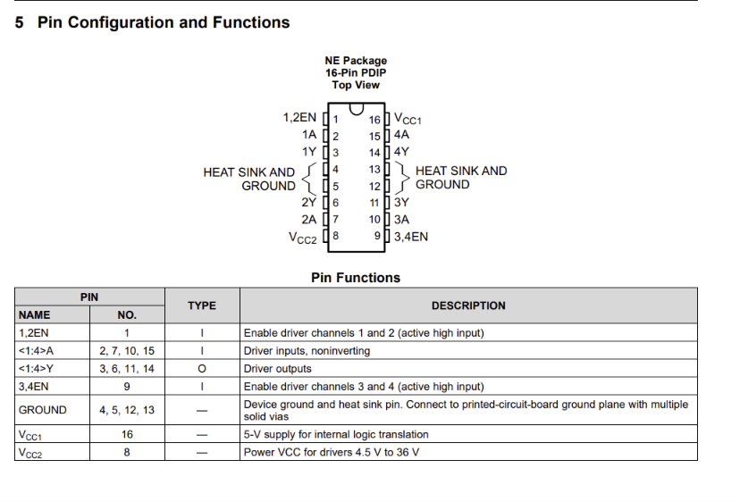
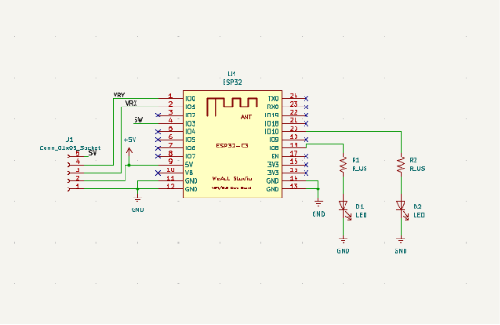
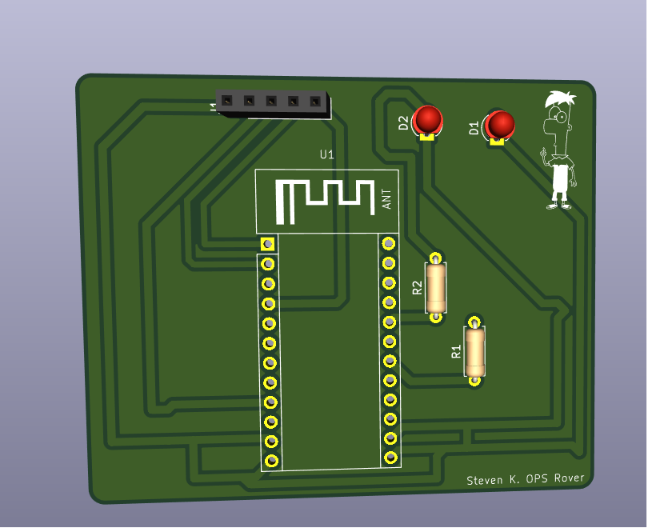
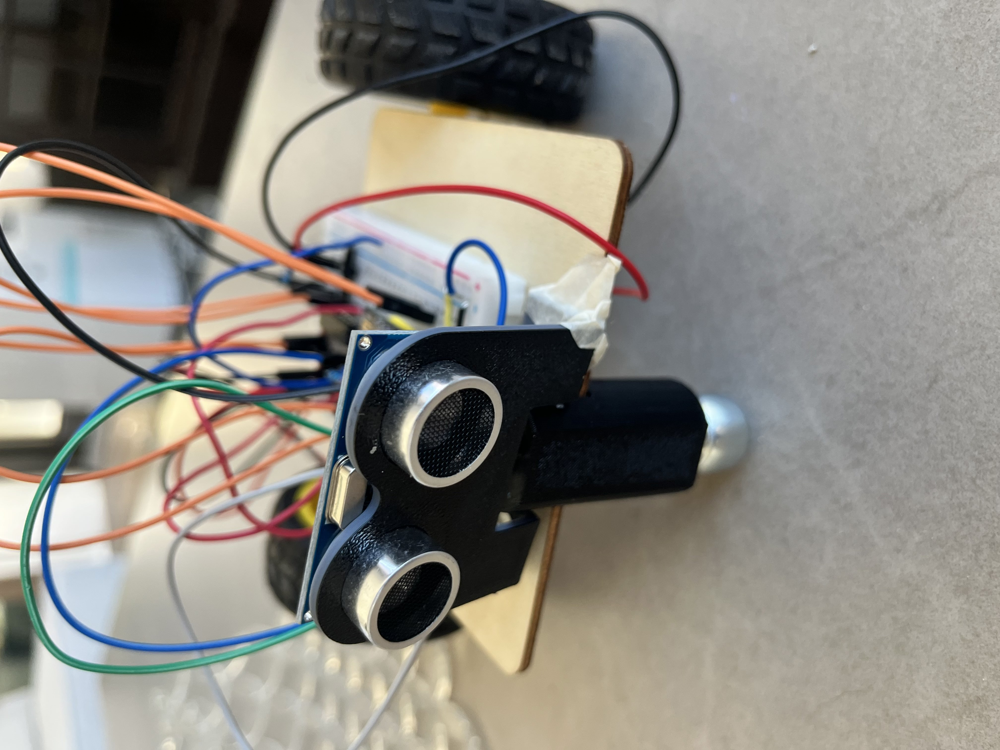
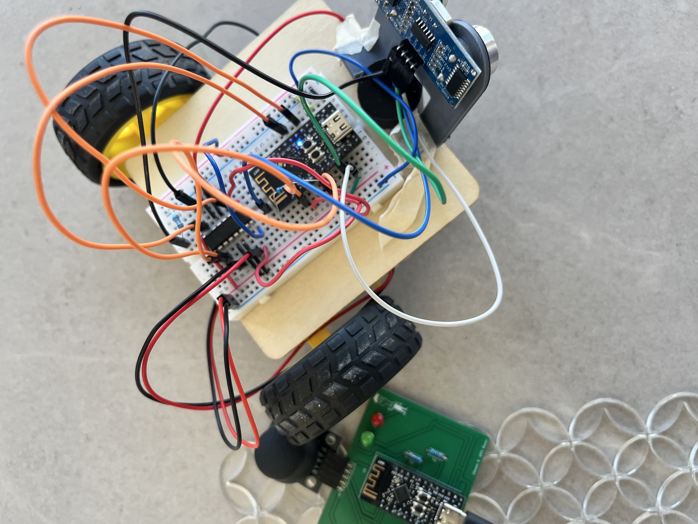

# IEEE_OPS_Capstone_Rover
DT - A Modified version of the UCI IEEE OPS Rover (25-26)
(Featuring Ferb from Phineas and Ferb) 
 
Special thanks to Marvin Ngyuen for PCB Design Support! 

## Documentation
- Link to Official Documentation from UCI IEEE: https://ieee.ics.uci.edu/ops/project_capstone.html 
- Bi-Directional Motor Driver Datasheet L293xD :  https://www.ti.com/lit/ds/symlink/l293.pdf 
- 

## JoyStick PCB Design

## Close-Up Images

## Footage of Testing 
YouTube Video: <a href="https://youtube.com/shorts/BwKgsygS7Fk" target="_blank" rel="noopener noreferrer"> IEEE_OPS_Capstone_Rover DT </

## Future Improvements
- [ ] Better AUTO movement using improved sensor detection and movement algorithm
- [ ] Additon of camera module with live stream of feed via  HTTP, with a WebSocket based interface for user control.
- [ ] Enable control via Joystick and Keyboard 
- [ ] Increase range of control 
